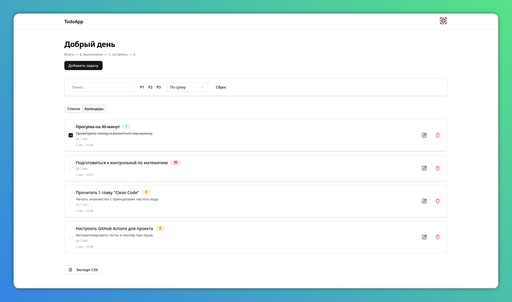

# Todo Fullstack App
Современное fullstack приложение для управления задачами, построенное с использованием Nuxt v4, FastAPI
и PostgreSQL.

## Особенности
- Аутентификация и авторизация с JWT токенами
- Адаптивный дизайн с shadcn/vue
- Real-time обновления (опционально с WebSocket)
- TypeScript для типобезопасности
- Docker для легкого развертывания
- Безопасность с хешированием паролей
- Валидация данных на всех уровнях
- Обработка ошибок и пользовательские уведомления

## Архитектура
```
todo-fullstack/
├── frontend/          # Nuxt v4 приложение
│   ├── components/    # Vue компоненты
│   ├── pages/         # Страницы приложения
│   ├── stores/        # Pinia stores
│   ├── middleware/    # Nuxt middleware
│   └── layouts/       # Layouts
├── backend/           # FastAPI приложение
│   └── app/
│       ├── routers/   # API роуты
│       ├── models.py  # SQLAlchemy модели
│       ├── schemas.py # Pydantic схемы
│       ├── crud.py    # CRUD операции
│       └── auth.py    # Аутентификация
├── database/          # SQL миграции
└── docker-compose.yml # Оркестрация сервисов
```

## Технологический стек

### Frontend
- [**Nuxt v4**](https://nuxt.com/) - Vue.js фреймворк с SSR
- [**shadcn-vue**](https://www.shadcn-vue.com/) - Современная UI библиотека
- [**Pinia**](https://pinia.vuejs.org/) - Управление состоянием
- **TypeScript** - Типизация

### Backend
- **FastAPI** - Современный Python веб-фреймворк
- **SQLAlchemy** - ORM для работы с БД
- **Pydantic** - Валидация данных
- **JWT** - Аутентификация
- **bcrypt** - Хеширование паролей

### База данных
- **PostgreSQL** - Реляционная база данных

### DevOps
- **Docker & Docker Compose** - Контейнеризация

***

## Быстрый старт

### Предварительные требования

- Node.js >= 18.0.0
- Python >= 3.8
- Docker и Docker Compose

### 1. Клонирование репозитория
```bash
git clone https://github.com/byntonna/Fullstack-todoApp-Nuxt-FastAPI.git
cd Fullstack-todoApp-Nuxt-FastAPI
```
### 2. Запуск с Docker (НЕ РАБОТАЕТ)
```bash
docker-compose up -d

# Приложение будет доступно по адресам:
# Frontend: http://localhost:3000
```
TODO: Реализовать Backend в Docker контейнер

### 3. Ручная установка

#### Backend
```bash
cd backend
python -m venv .venv
source .venv/bin/activate  # Linux / Mac
# или
.venv\Scripts\activate  # Windows

pip install -r requirements.txt

touch .env
# Отредактировать .env файл
# Структура .env фалйа:
# AUTH_SECRET_KEY=<jwt-ключ>

# Запуск БД
docker run -d \
  --name postgres-todo \
  -e POSTGRES_DB=todoapp \
  -e POSTGRES_USER=todouser \
  -e POSTGRES_PASSWORD=todopass \
  -p 5432:5432 \
  postgres:15

# Запуск сервера
uvicorn app.main:app --reload --host 0.0.0.0 --port 8000
```

#### Frontend
```bash
cd frontend

npm install  # Установка зависимостей

# Запуск dev-сервера
npm run dev
```

***

## TODO (Дальнейшие улучшения)

 - WebSocket для real-time обновлений
 - Фильтры и сортировка задач
 - Категории и теги
 - Прикрепление файлов
 - Совместная работа над задачами
 - Интеграция с календарем
 - Экспорт данных
 - Темная тема
